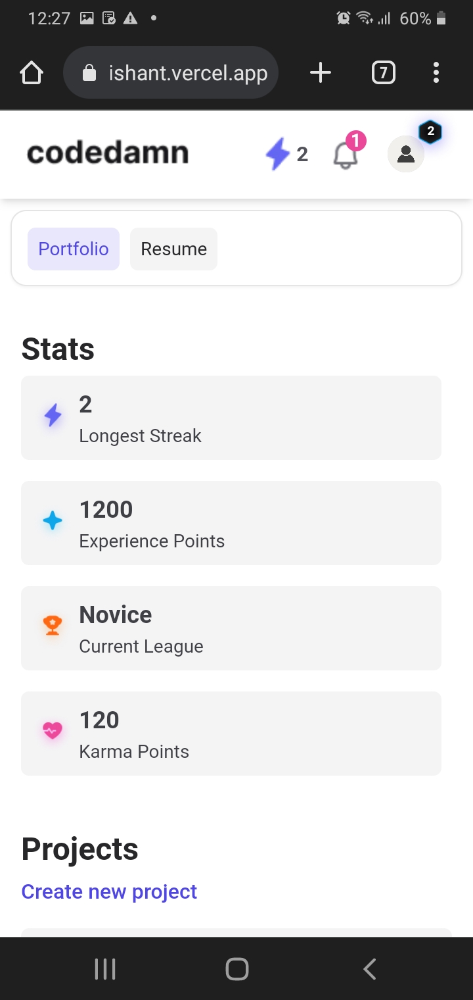
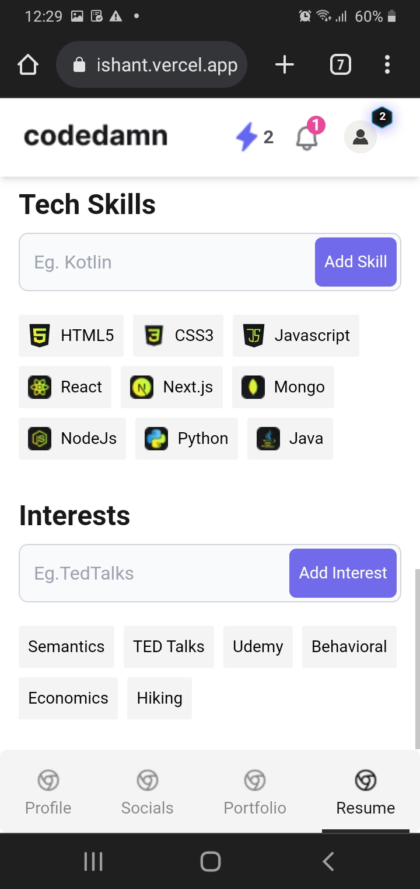

# **Codedamn Assessment**

This repository is my submission for codedamn assessment. It contains implementation of the following design:
https://www.figma.com/file/TXLwYa51OaUfXRjO5AQvL0/Codedamn-Frontend-Assessment

## About :dart:

This project contains UI implementation and functionality of all the features provided in the assesment document. They include:

- Profile page with portfolio and resume section
- Feature to add new projects, playgrounds and certificates in portfolio section
- Change profile picture
- Change cover image
- Edit profile information and social links
- Manage profile section visibility
- Fully fledged resume builder where you can add experience, education, skills and many more things
- 100% mobile responsive
- Collected user data and images are saved in the local storage
- DX friendly code (Linting and prettier formatting applied)

## Demo

You can test this website using the link: https://codedamn-ishant.vercel.app/

## Project Structure

## 📸 Screenshots :computer:

### Profile page with portfolio

### Profile page with resume

### Edit profile page with portfolio tab

### Edit profile page with socials tab

### Edit profile page with portfolio tab

### Edit profile page with resume tab

## 📸 Screenshots :iphone:

|                                             |                                             |                                             |
| ------------------------------------------- | ------------------------------------------- | ------------------------------------------- |
|   |   |   |
|   |   |   |
|   |   |   |
|  |  |  |
|  |  |  |
|  |  |  |

## Contact

For any queries, you can mail me at developerishant710@gmail.com
